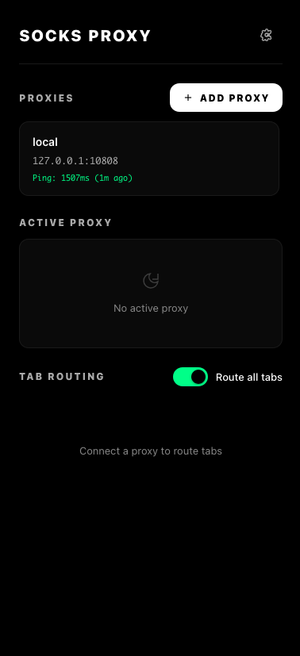
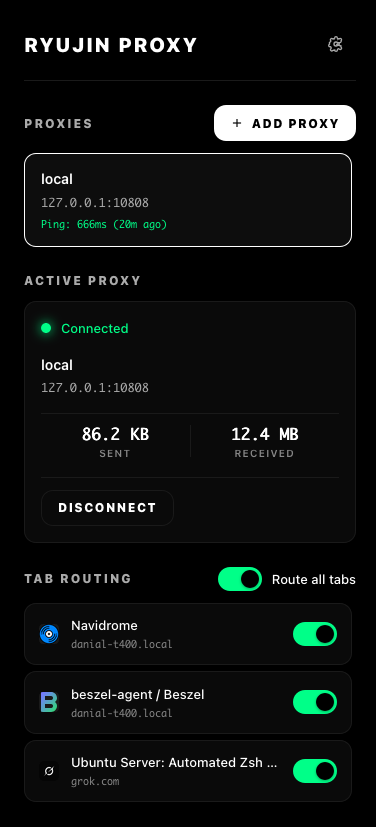
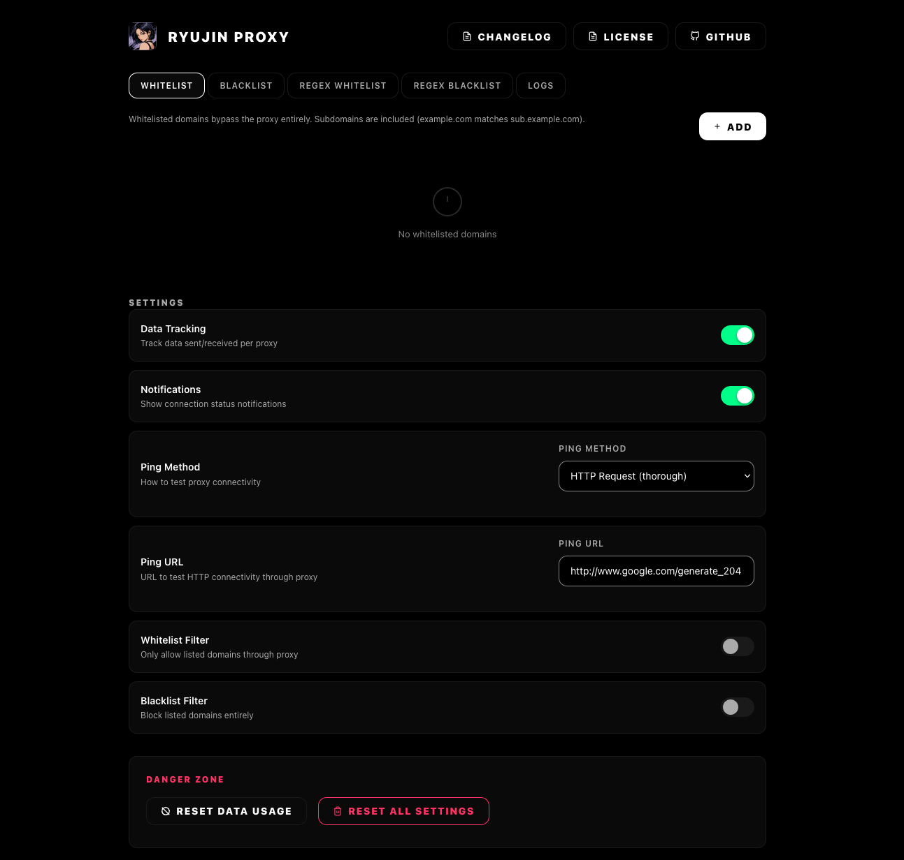

<pre>
                      ▄   ▄                                              
█▀▀▀▄                 ▀   ▀                █▀▀▀▄                         
█   █ █   █ █   █    ▀█  ▀█   █▀▀▀▄        █   █ █▄▀▀▀ ▄▀▀▀▄ ▀▄ ▄▀ █   █ 
█▀█▀  █   █ █   █     █   █   █   █        █▀▀▀  █     █   █   █   █   █ 
█  ▀▄ ▀▄▄▄█ ▀▄▄▄█     █  ▄█▄  █   █        █     █     ▀▄▄▄▀ ▄▀ ▀▄ ▀▄▄▄█ 
       ▄▄▄▀        ▀▄▄▀                                             ▄▄▄▀ 
</pre>

**Ryujin Proxy** — A minimal, privacy-focused SOCKS5 proxy manager for Firefox.

---

## Screenshots

  
  

  

---

## Features

- **Simple Proxy Setup** — Add SOCKS5 proxies with optional authentication
- **Per-Tab Control** — Choose which tabs use the proxy, or route all tabs automatically
- **Live Data Usage** — See exactly how much data each proxy sends and receives
- **Smart URL Filtering** — Whitelist, blacklist, or use regex patterns
- **Clean Interface** — Distraction-free, dark-themed design
- **No Tracking** — Everything runs locally in your browser, no accounts or cloud sync
- **Logs & History** — View system logs with filtering, track ping history per proxy

## Quick Start

1. **Install** — Download the latest `.xpi` from [Releases](https://github.com/danial2026/ryujin-proxy-firefox-extension/releases) and drag it into Firefox
2. **Add a Proxy** — Click the extension icon → "Add Proxy" → enter your SOCKS5 host, port, and optional credentials
3. **Connect** — Click any proxy in the list to activate it (green dot = connected)
4. **Route Tabs** — Use "Route all tabs" for everything, or toggle individual tabs in the list

## URL Filtering

Control exactly which websites use the proxy:

| Filter Type | Behavior |
|-------------|----------|
| **Whitelist** | Only these domains bypass the proxy (subdomains included) |
| **Blacklist** | These domains are blocked entirely |
| **Regex Whitelist** | JavaScript regex patterns that bypass the proxy |
| **Regex Blacklist** | JavaScript regex patterns that are blocked |

Example: Add `^https?://.*\.ads\..*$` to Regex Blacklist to block all ad domains.

## Settings

Open the full settings page from the extension menu (gear icon) to:
- Manage URL filters
- Toggle data tracking
- Configure ping method/URL
- Reset usage statistics
- View changelog and license
- View system logs with filtering

## Privacy

- **No data collection** — Nothing leaves your browser
- **No permissions abuse** — Only requests permissions needed for proxy functionality
- **Open source** — [MIT licensed](LICENSE), audit the code yourself

## Requirements

- Firefox 91+ (Manifest V2)
- A SOCKS5 proxy server (not included)

## Support

- **Issues:** [GitHub Issues](https://github.com/danial2026/ryujin-proxy-firefox-extension/issues)
- **Changelog:** [CHANGELOG.md](CHANGELOG.md)
- **Technical docs:** [TECHNICAL.md](TECHNICAL.md)

## License

MIT License — see [LICENSE](LICENSE) for details.
